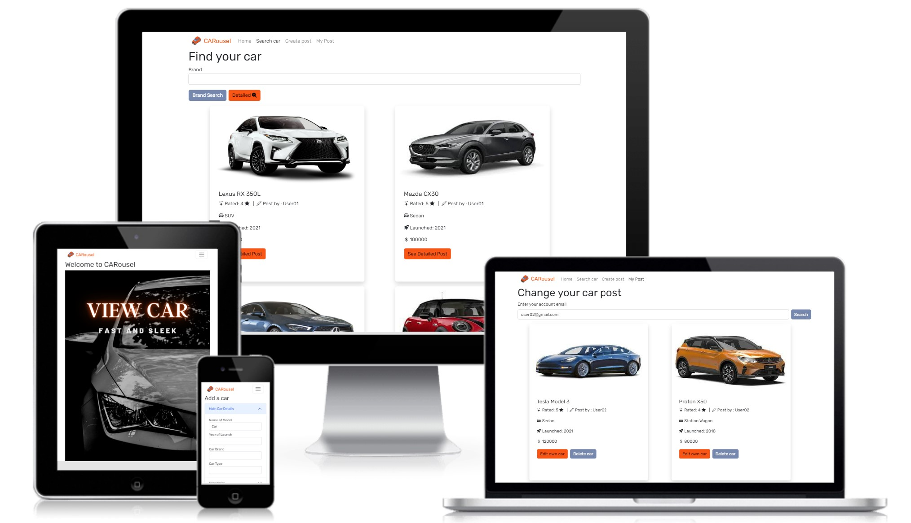
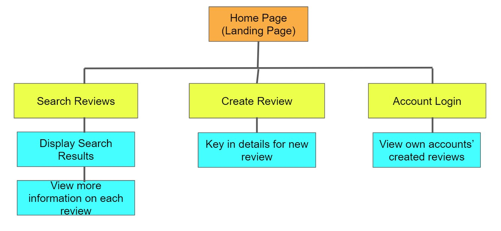
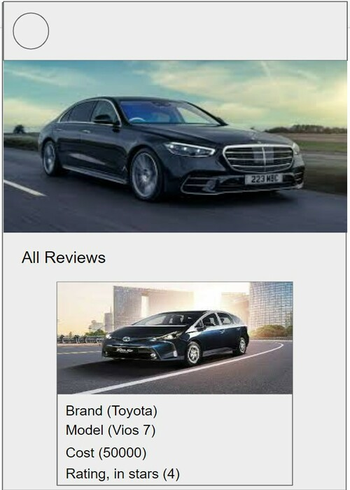
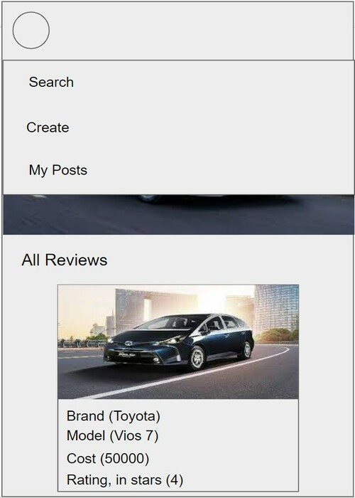
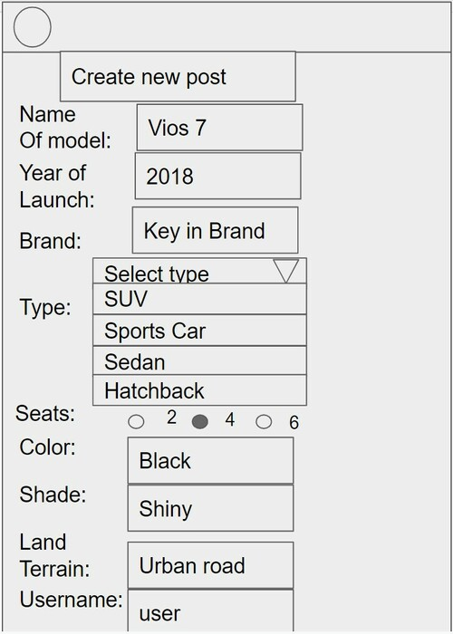
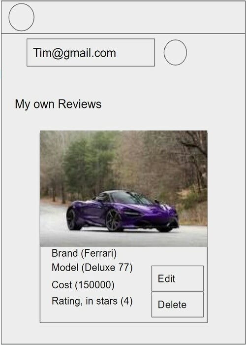
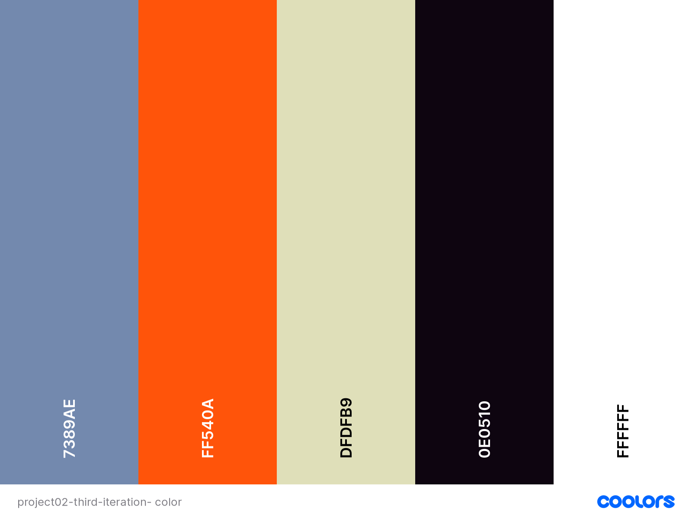

# CARousel

Access live demo site [CARousel](https://0-carousel-project.netlify.app/)

## Background

There are many car buyers and hobbyists. They enjoying learning and looking at different kinds of cars. However, there is not a website that allows users to crowdsource different types of cars and create reviews about it. 

## Project Overview

Prospective car buyers or hobbyists usually find information on the car showroom website. They want to know the look, price, functionalities and features of the car. 

Looking at the rating of cars from other users are useful for them to determine if this is a well-received car. 
Sharing these information allow them to know about the potential of buying a certain car they have in mind. 

---

## The Five Planes of UI/UX

### Strategy

#### Organization's Goals
I usually get information on cars by reading car magazines or showroom website description. This car review site centralises all the information of different brands of cars and gives users a convenient and unbiased description of cars that they may be interested in. 

#### Users' Goals
 The users of this site are usually aged 25 -35, use the internet for researching items they want to buy and enjoy reading other's reviews of using certain products. They would like to know the benefits of a certain car, compare with other types of cars, and see the reception of other users toward the functionality of a car. 

1. **Organisation**
   - Objective: To aggregate users postings and reviews about different types of cars onto a website

2. **Users: Travellers**
   - Objective: To find a certain type of car they want to know more about and get more details on the specific functions of the car 

   - Needs:
      - Search about the car they may be interested in 
      - Create posting on cars they want to review
   
   - Demographics and Characteristics:
       - Working young people
       - Interest in car
       - Enjoys reading review websites 
   
   - Pain point:
       - want to know the specifications of a car
       - Want to see the look of a car
       - Want to know other user’s opinions of the car

User Stories | Acceptance Criteria(s)
------------ | -------------
As a car hobbyist, I want to share my reviews about a car with other user | Website must allow creating of post and adding details of car. 
As a car hobbyist, I want to learn more about new cars by viewing others review post on car
| Website must allow searching and display of information of car to users
As a car hobbyist, I would like to comment and ask user about car | Website must allow user to ask questions or comment on other's reviews.  
As a car hobbyist, I require a search rating of car and car name | Website should allow search of car by name and current rating by reviewer
Know specific features of a car | Website must display the features of the car so users know whether this is the car of their choice

### Scope

### Database

An Express server is used to store the information and access endpoints on a MongoDB. 

#### Content
The content about cars is contributed by the public. Users can view the overview of the site on the main landing page. 

#### Functional
- Search current car posting by name, feature, rating
- Create new article function
- Edit and Delete each car posting 
- Require to create account with email and login in order to edit car review. 

#### Non-functional
- Mobile responsiveness: Able to navigate on the handphone and access website features
- Accessibility: Clear readable font in specific size and color to enable concise communication. 
- Performance: Ensure the website does not have jerky transition while data is loading and once it has been loaded. 

### Structure

### Skeleton
The initial design draft are detailed here. The initial design was a rough sketch and changes were made in the subsequent stages of website deploying. 

These are the images

#### Color Scheme

- Orange color is a fresh and eye catching color to draw people attention 
when viewing cars.
- Grey is a contrasting color that complements orange and can be used for subsidiary functions.
-White is used to give a modern and clean look.
- Black is used to display font clearly.

#### Font
- The font chosen was Rubik to ensure a clean and modern look. It is also easy to read to help users find information easily. 
---

## Testing
Test Cases can be found [here](./src/Testcases.pdf)

---

## Dependencies and Sources

### Backend
1. [Express](https://expressjs.com/) provide route to API endpoints
2. [MongoDB Node Driver](https://www.mongodb.com/docs/drivers/node/current/) database to call on for the API 
3. [cors](https://www.npmjs.com/package/cors) enable CORS
4. [dotenv](https://www.npmjs.com/package/dotenv) to store away information 
like passwords
5. [Yup](https://github.com/jquense/yup) utilised for backend validation
### Frontend
1. [React](https://reactjs.org/) interface to display front end
2. [Axios](https://axios-http.com/) client that consumes endpoints
3. [React-Bootstrap](https://react-bootstrap.github.io/) to style the site, forms and provide interactive features

### Platforms and Software
1. [VSC](https://code.visualstudio.com/) IDE to edit code
2. [GitHub](http://github.com) for the repository
3. [Render]() to deploy Backend server
4. [Netlify](https://www.netlify.com/) for deployment of React app

### Logos and Images
1. Car logo is attributed to [Canva](https://www.canva.com/icons/MACB3YTa1g4-orange-car-isometric/)
2. Landing page background photo is by [Garrett Parker](https://unsplash.com/@garrettpsystems) downloaded from [Unsplash](https://unsplash.com)

   
### Other Attributions
1. [Paul Chor](https://github.com/kunxin-chor) tutorial in providing guidance on creating app
2. [Jun Hao](https://github.com/JunHao-k/wanderlust_fe) reference for ReadMe file and backend deployment advice

---

## Deployment

### Build
Build using Node.js and Express on the Backend. React Frontend is built through the create-react-app.

### Backend Deployment
Express server is deployed using [Render](https://render.com/).

Prerequisites:
- Github account is authorised on Render deployment.
- Backend Github folder is synced with Render deployment.
- Auto updates to Render is triggered when changes are pushed to 
Github repository. 

Steps to publish:
1. Push changes to Github to ensure latest version is deployed on Render.
2. Render will update changes with new pushses.

### Frontend Deployment
[

The React app is hosted using [Netlify](https://www.netlify.com/).

Prerequisites:
-  Github account is authorised on Render deployment.
- Frontend Github folder is synced with Netlify deployment.
- Auto updates to Netlify is triggered when changes are pushed to 
Github frontend repository. 

Steps to publish:
1. Push changes to Github to ensure latest version is deployed on Netlify.
2. Netlify will update changes with new pushses.

---